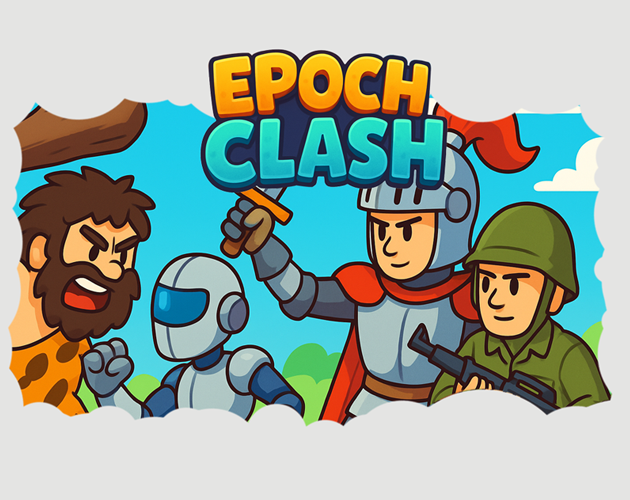
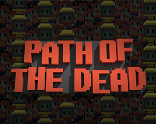
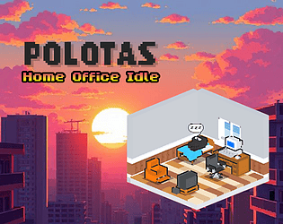

# 👋 Hi, I'm Afonso Oliveira

🎮 **Unity Game Developer**  
Focused on gameplay programming, systems design, and small-to-mid scale game projects.

🔗 **LinkedIn:**  
https://www.linkedin.com/in/afonso-oliveira-a0980628/

---

## 🎮 My Games

<table>
  <tr>
    <td align="center">
      <a href="https://onegear.itch.io/epoch-clash">
        
         
        <b>Epoch Clash</b>
      </a>
    </td>
    <td align="center">
      <a href="https://onegear.itch.io/path-of-the-dead">
        
         
        <b>Path of the Dead</b>
      </a>
    </td>
    <td align="center">
      <a href="https://onegear.itch.io/polotas">
        
         
        <b>Polotas</b>
      </a>
    </td>
        <td align="center">
      <a href="https://polotas.github.io/wingrumble/">
        
         
        <b>Polotas</b>
      </a>
    </td>
  </tr>
</table>

---

## 🛠️ Skills & Tools

- Unity (2D / 3D)
- C#
- Gameplay Programming
- Game Systems & Mechanics
- Prototyping
- Version Control (Git)
- Android/IOS/PC/WebApp Builds 

---

## 🌍 Where to Find Me

- 🎮 Itch.io: https://onegear.itch.io  
- 💼 LinkedIn: https://www.linkedin.com/in/afonso-oliveira-a0980628/
